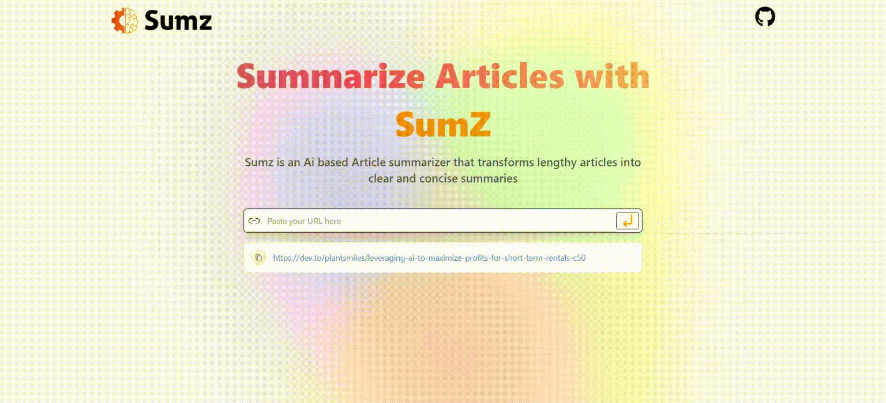

# Article Summarizer

This is an Ai based article summarizer that leverages artificial intelligence to provide concise and coherent summaries of articles. It simplifies the process of extracting key information from lengthy articles, enabling users to quickly grasp the main points without reading the entire content.

## Features

- **Advanced Summarization**: Our AI-powered algorithm employs natural language processing techniques to analyze and understand the input text, generating accurate and coherent summaries.

- **Translate to your local language**: You can translate the summary to your local language

- **User-Friendly Interface**: The web application offers a clean and intuitive user interface, making it easy for users to interact with the summarization tool effortlessly.

## Usage

1. Open the AI Article Summarizer web application in your preferred web browser.

2. Paste the URL of the article you wish to summarize.

3. Click the "Enter" icon, and the AI algorithm will generate a concise summary of the article.

4. Review the summary and use it as a quick reference or to decide whether to explore the full article further.

   

## Installation

To run the AI Article Summarizer locally, follow these steps:

1. Clone the repository to your local machine.

2. Install the required dependencies using `npm install`.

4. Start the local development server using the command `npm run dev`.

5. Access the application through your web browser at `http://localhost:5173/`.

## Support

If you encounter any issues, have questions, or need further assistance, please reach out to our support team at [kundusubhajit73@gmail.com]. We are here to help!

